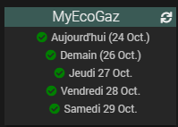

EcogazSync
==========

Description
-----------

Plugin permettant de s'interfacer avec l'API Ecogaz.

Installation
============

a. Installation

- Télécharger le plugin

- Activer le plugin
Pour cela il suffit d'aller dans la Gestion des plugin et de cliquer sur l'icône "EcogazSync" puis sur "Activer"

- Explication du cronHourly
La synchronisation tourne tous les jours à 1h pour récupérer les données jusqu'à J+4. Le Daily tourne à minuit et les informations J+4 ne sont pas encore disponibles sur l'API Ecogaz.

- Ajout d'un équipement pour activer une API Ecogaz
Aller dans le menu Plugin -> Energie -> EcogazSync

Puis cliquer sur "Ajouter"

- Choisissez un nom d'équipement et vous arriverez sur la page de configuration

- Vous pouvez cliquer sur "Activer" et "Visible" puis "Sauvegarder" (et choisir l'objet parent si vous le souhaitez).

- Ensuite vous pouvez vous rendre dans l'onglet "Commandes" et cliquer sur le bouton Tester correspondant à la commande "refresh". Les commandes manquantes vont se créer et le widget s'affichera dans le dashboard. (cette étape est facultative car si vous allez sur le dashboard sans données alors le refresh se lancera automatiquement)

